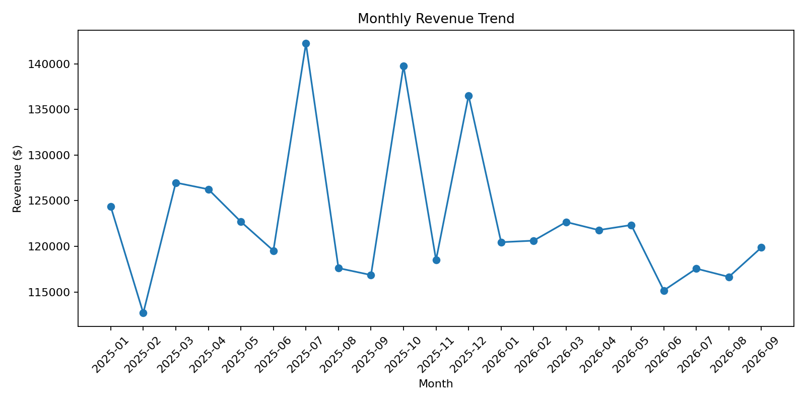
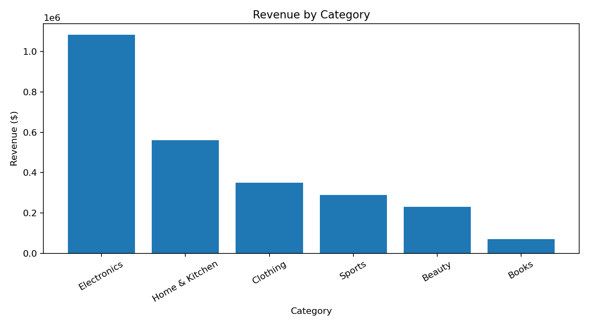

# E-Commerce Sales & Customer Analytics 📊

## Overview
A portfolio-ready business analytics project built with synthetic e-commerce transaction data. The project demonstrates data cleaning, exploratory analysis, SQL, Python visualization, and Power BI dashboard planning.

## Dataset
- 12,000 synthetic orders
- January 2025 through September 2026
- 2,500 possible customers
- 6 product categories
- 15 U.S. states
- Multiple sales channels and payment methods

**Note:** This is synthetic data created for portfolio/learning purposes. It does not represent a real company or real customers.

## Business Questions
1. What is the monthly revenue trend?
2. Which product categories generate the most revenue?
3. Which states have the highest revenue?
4. Which customers generate the most revenue?
5. Which products sell the most units?
6. Which categories have higher return rates?
7. Which sales channels have the highest average order value?

## Tools
- Python
- Pandas
- NumPy
- Matplotlib
- SQL
- Power BI
- Git/GitHub

## Project Structure
```text
ecommerce-sales-analysis/
├── data/
│   └── ecommerce_sales.csv
├── notebooks/
│   └── ecommerce_analysis.ipynb
├── sql/
│   └── analysis_queries.sql
├── dashboard/
│   └── POWER_BI_GUIDE.md
├── src/
│   └── analysis.py
├── outputs/
├── requirements.txt
└── README.md
```

## How to Run

### 1. Clone the repository
```bash
git clone git@github.com:naveenrasala009-dot/ecommerce-sales-analysis.git
cd ecommerce-sales-analysis
```

### 2. Create a virtual environment
```bash
python3 -m venv .venv
source .venv/bin/activate
```

### 3. Install dependencies
```bash
pip install -r requirements.txt
```

### 4. Run the analysis
```bash
python src/analysis.py
```

Results will be created in `outputs/`.

## Key Portfolio Skills Demonstrated
- KPI development
- Revenue and customer analysis
- Aggregation and segmentation
- SQL business queries
- Data visualization
- Dashboard requirements
- Business storytelling

## Portfolio Note
This project intentionally uses synthetic data so it can be shared publicly without exposing confidential or personally identifiable information.

## Analysis Results

### Monthly Revenue Trend


### Revenue by Product Category


